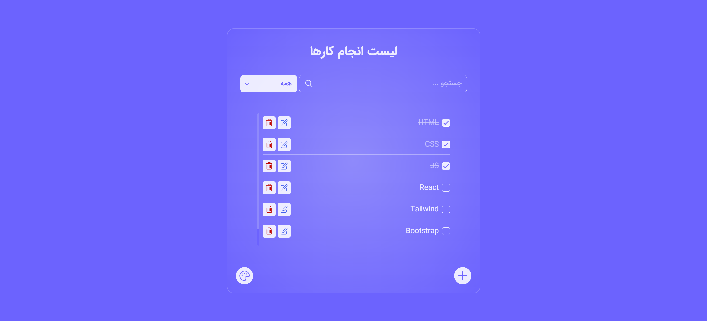

# TodoList

A modern **Todo List** application built with **HTML, CSS, and JavaScript**.  
This project helps users manage their daily tasks with a clean UI and useful features.

## Live Demo

🔗 **View Online:**  
https://dorsa-piraneh.github.io/git-test/


## Screenshots




## Features

- **Add Tasks**: Create new tasks easily.
- **Edit Tasks**: Update task titles.
- **Delete Tasks**: Remove tasks with a confirmation modal.
- **Mark as Complete**: Toggle tasks between completed and pending states.
- **Search Tasks**: Real-time search through tasks.
- **Filter Tasks**: View all, completed, or pending tasks.
- **Themes / Color Palette**: Multiple color themes with persistent selection.
- **Responsive Design**: Optimized for mobile, tablet, and desktop screens.
- **SweetAlert2 Integration**: User-friendly alerts and confirmations.
- **Persistent Storage**: Tasks and selected theme are saved using **LocalStorage**.
- **Custom Font**: Uses **IRANSans** for better Persian typography.


## Installation & Usage

### Option 1: Run Locally (No Git Required)
1. Download the project as ZIP.
2. Extract the files.
3. Open `index.html` in your browser.

### Option 2: Clone with Git
```bash
git clone https://github.com/dorsa-piraneh/git-test.git
```
Then open `index.html` in your browser.


## Technologies Used

- HTML5
- CSS3 / CSS Variables
- JavaScript (ES6)
- SweetAlert2
- FontAwesome Icons
- LocalStorage API


## Author
<p>Dorsa Piraneh</p>
[GitHub](https://github.com/dorsa-piraneh)


